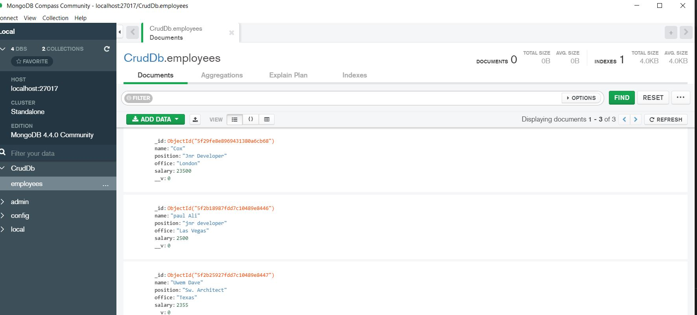

# Angular - CRUD OPERATION

This project was generated with [Angular CLI](https://github.com/angular/angular-cli) version 9.1.6.

## Introduction
* Node.js is a server side JavaScript execution environment. It’s a platform built on Google Chrome’s V8 JavaScript runtime. It really helps in building highly scalable and concurrent applications rapidly.

* Express is lightweight framework used to build web applications in Node. It provides a number of robust features for building single and multi page web application. Express is inspired by the popular Ruby framework, Sinatra.

* MongoDB is a schemaless NoSQL database system. MongoDB saves data in binary JSON format which makes it easier and better to pass data between client and server.

* AngularJS is a JavaScript framework developed by Google. It provides some awesome features like the two-way data binding. It’s a complete solution for rapid and awesome front end development.

## Goal of the project
The goal of this tutorial is to build a full-stack JavaScript application project and connecting a backend API to an Angular 9 front-end application employing the MEAN stack operation.
CRUD in this context stands for Create Read Update and Delete.

The main focus of our content is Angular, but in order to develop more powerful full stack Angular apps, it's necessary to integrate the Angular front-end with a real back-end. The MEAN stack is one of the most common stacks that accompany Angular as a frontend framework. MEAN stands for MongoDB, ExpressJs, Angular and NodeJS.

In this CRUD app, user will be able to perform the following:

* Add employee name (Mandatory in this application)
* Add employee position
* Add employee locaition
* Add employee salary
* Edit emplyee details
* Delete employee details
* Reset/Clear the form

## Key notes
* Setting up Node js
* Setting up Angular CLI
* Installing & setting up Angular project
* Creating routes to navigate between components
* Creating Angular service to manage CRUD operations
* Consuming RESTful APIs using Angular Service

## Following Technologies are used

* NodeJs
* NPM
* Express
* MongoDB | NoSql
* Angular
* Postman

## Sample Outputs

## Development server

Run `ng serve` for a dev server. Navigate to `http://localhost:4200/`. The app will automatically reload if you change any of the source files.

## Code scaffolding

Run `ng generate component component-name` to generate a new component. You can also use `ng generate directive|pipe|service|class|guard|interface|enum|module`.

## Build

Run `ng build` to build the project. The build artifacts will be stored in the `dist/` directory. Use the `--prod` flag for a production build.

## Running unit tests

Run `ng test` to execute the unit tests via [Karma](https://karma-runner.github.io).

## Running end-to-end tests

Run `ng e2e` to execute the end-to-end tests via [Protractor](http://www.protractortest.org/).

## Further help

To get more help on the Angular CLI use `ng help` or go check out the [Angular CLI README](https://github.com/angular/angular-cli/blob/master/README.md).

## Contact
Repo created by <a href="https://github.com/Mbboutidem">Mbuotidem</a>
